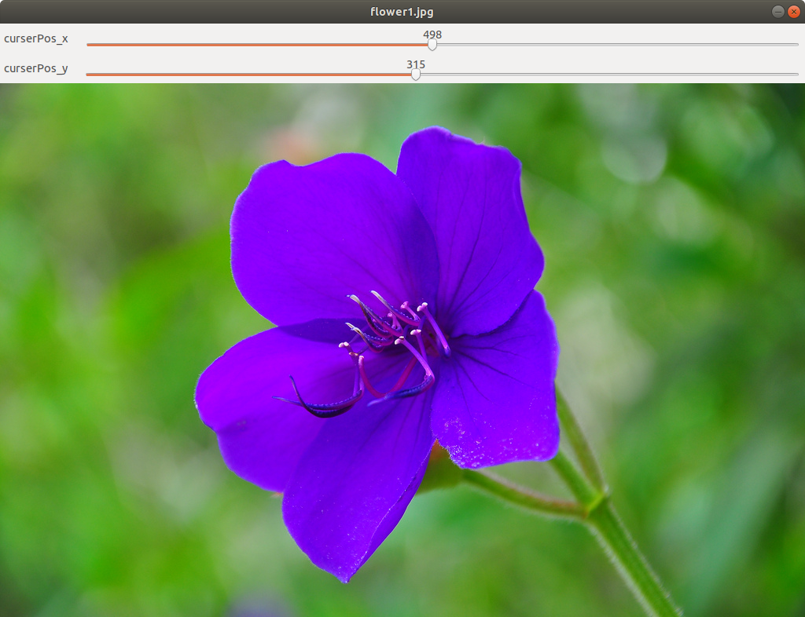
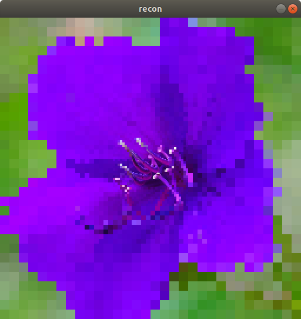
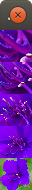
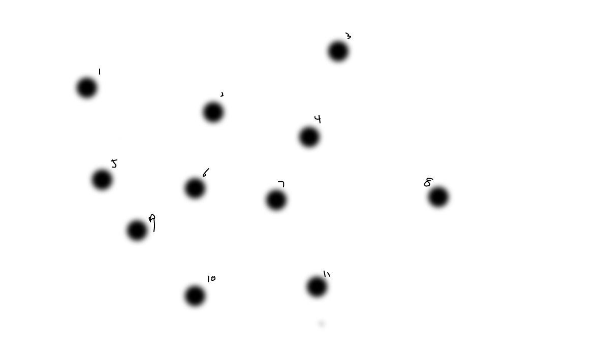
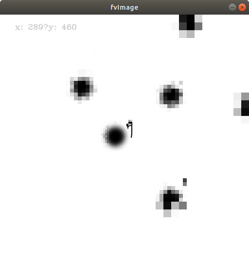
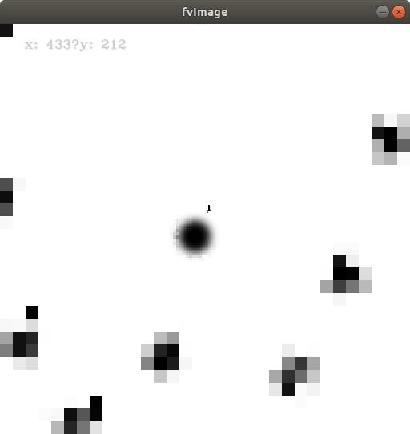
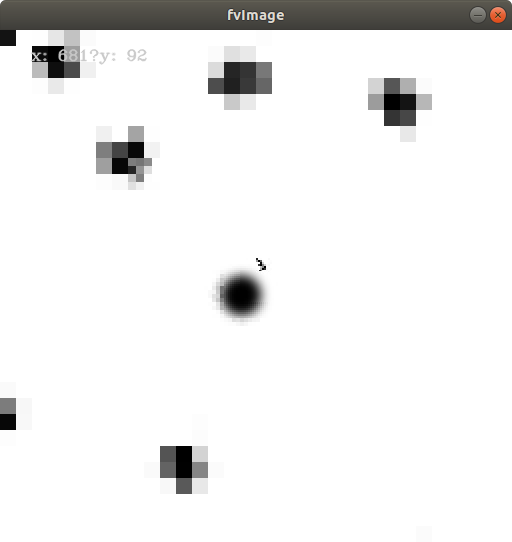

# FoveatedVision Library

A c++ project based on
[](https://opencv.org/)

FoveatedVision Library aims at creating a tool to accerate image processing.

# Table of Contents
1. [Innovation](#Innovation)
2. [Build](#Build)
3. [API](##API)
4. [Demos](#demo)

## Innovation
Human vision has a 
## Build

##### File structures
The file structure of the project:

| DirName | Usage |
| ------ | ------ |
| FVlibs | C++ Library for foveated Vision|
| Matlab | Matlab test codes |
| demo | several demo programs using the libray |
| test | testcases |
| utilities | utility functions/files |
| img | Used image and results |

##### Prerequest
The project requires installation of opencv libraries(Version used: `openCV 4.0.1`) and support for `c++11`.

You can install openCV through [`homebrew`](https://brew.sh/) on Mac:
```sh
$ brew install opencv
$ brew install pkg-config
```
You can install openCV from [`source`](https://docs.opencv.org/3.4/d7/d9f/tutorial_linux_install.html) or package manager on Linux machines.

Make sure 
```sh
$ pkg-config opencv --cflags --libs
```
can correctly return link info for opencv libraries.


To build the library only:
```sh
$ cd FVlibs
$ make clean
$ make libs
```
A static library named `FVlib.a` will be created. Use the library with the `.h` files in the same directory.

To build demos, execute 
```sh
$ cd demo
$ make demo1
$ make demo2
$ make demo3
```
to build each demo separately if **the library is already compiled and saved as FVlibs/FVlib.a**.

To build **the library and all demos together**, execute
```sh
$ cd demo
$ chmod +x build.sh
$ ./build.sh
```
## API
The library structure:

| filename | Usage |
| ------ | ------ |
| color.h/cpp | color class for foveated images|
| field.h | field class storing info of each layer |
| foveatedImage.h/cpp | foveatedImage class |
| foveatredVideo.h/cpp | fv class for webcam stream(not implemented yet) |
| img | Used image and results |

**foveatedImage.h/cpp `foveatedImage_t` class member function interface:**


> **foveatedImage_t(cv::Mat* rawImage, cv::Point centerPosition, channel_t channel);**
Create a foveated image object from an openCV Mat image. Must specify fovea center on the raw image. Color channel can be either `bgr` or `grayscale`.


> **void resetCenter(cv::Point newCenter);**
Choose a new center for current foveated image.


> **cv::Mat* createReconstructedImage();**
Create a visualized reconstructed foveated image.
Example Reconstrcuted image.

> **cv::Mat* getReconstructedImage();**
return pointer of the reconstructed image. Call  `createReconstructedImage()` if recon image not yet created.


> **void freeReconstructedImage();**
free memory of reconstrcuted image.

>**cv::Mat* createFoveatedSeries();**
visualize all layers in a series of imges.

> **cv::Mat* getFoveatedSeries();**
return pointer of foveated image series. Call `createFoveatedSeries()` if series not yet created.

>**void freeFoveatedSeries();**
free memory of foveated image series.

>**cv::Point getCenterPos()**
return the fovea center in the original image.

>**cv::Mat getLayer(int i);**
return layer image.

Sample rawImage and corresponding reconstructed image and foveat image series:
<p float="left">
    
</p>

## demo
Current project includes 3 simple demos:

#### demo1
Usage:
```sh
$ ./demo1 [imagename] [colorType]
```
`colorType` can be either 0(bgr) or 1(grayscale).

Click on the original image to set the center position of the foveated image. The x,y pixel location can be seen on the track bar of the original image.

#### demo2
Usage:
```sh
$ ./demo2
```
**Need a valid webcam to run the program**.
This demo reads video stream from your default camera and create a corresponding foveated video stream.

The original video is displayed in window webcam, and foveated video i sdisplayed in window foveatedVideo.

[sample raw video](https://youtu.be/HaR8QxSTn4g)

[sample foveated video](https://youtu.be/XfGjeiPaKXg)

####demo3
This demo reads an image of "black dots", and we sacade through the image using foveated vision to find those salient objects.
Usage:
```sh
$ ./demo3 [imagename]
```
The program will pause once a salient or salient candidate is found, and move center of foveated image to the "interesting area". Press any key to go into next iteration.


example input:



captures salient:






Muyang Wang 2019


